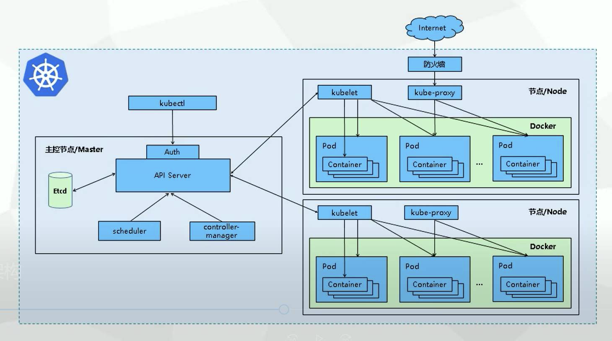

# Kubernets 学习笔记

## 第一节 kuebernets 概述

## 1.1 K8s是什么

- kubernets简称k8s;
- k8s本质上是一组服务器集群，k8s可以在集群的各个节点上运行特定的docker容器；
- K8s用于容器化应用程序部署，扩展和管理；
- k8s是Google在2014年开园的一个容器集群管理系统；
- k8s提供了容器编排，资源调度，弹性伸缩，服务管理。服务发现等一系列功能；
- k8s目标是让部署容器化应用简单高效。

## 1.2 k8s功能

- 自我修复
- 弹性伸缩: 根据服务器的并发情况，并发或者缩减容器数量
- 自动部署和回滚: yaml文件
- 服务发现和负载均衡
- 机密和配置管理

## 1.3 k8s 节点

k8s分为两类结点:

- master node：主结点
- work node：工作结点

### 1.3.1 master 节点的组件(程序)

- Api Server：集群的统一入口，各组件的协调者，以RestFul API提供接口服务，所有对象资源的增删改查和监听等操作都交给API Server处理后再提交给Etcd存储 (接收客户端操作可执行的k8s命令)；
- scheduler：根据调度算法为新创建的Pod选择一个Node节点，可以任意部署，可以部署在同一个节点上，也可以部署在不同节点上（从多个work node节点的组件中选举一个来启动服务)；
- controller manager：处理集群中常规后台任务，一个资源对应一个控制器，而controller manager就是负责管理这些控制器的（向work节点的kubelet发送指令);
- etcd: 分布式键值存储系统，用于保存集群状态数据，比如Pod，Service等对象信息（欢聚话说即 k8s数据库，用来注册节点、服务、记录账号等一系列操作）

### 1.3.2 node 节点的组件(程序)

- kubelet：向docker发送指令管理docker容器的；
- kubeproxy：管理docker容器的网络

**k8s架构图下**

容器启动的一个过程:

- 客户端向API Server发送请求，即kubectl → API Server
- API Server收到请求后，会向scheduler发送指令，即API Server→scheduler
- scheduler会向后端若干个结点中寻找一个节点（例如节点/node1），即schedule→（寻找node结点）节点/node
- scheduler寻找到节点后，scheduler会将结果返回API Server 即scheduler→API Server
- API Server接收到scheduler返回的寻找的结点后，会传递给controller manager 即API Server → controller manager
- controller manager 会向选定的结点（例如节点/node1）发送指令消息，即controller→kubectl
- kubectl 收到controller传递过来的信息后，会向本地主机docker发送指令,启动一个容器（即pod），即kubectl→（本地）docker

