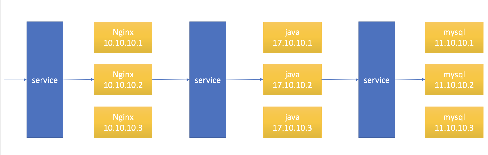
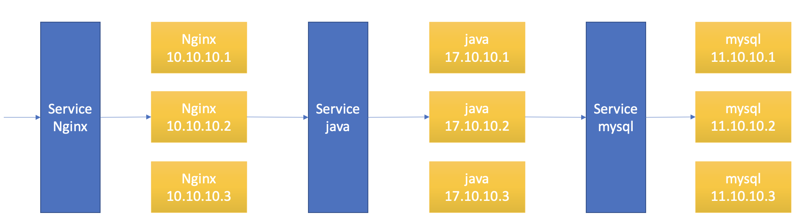
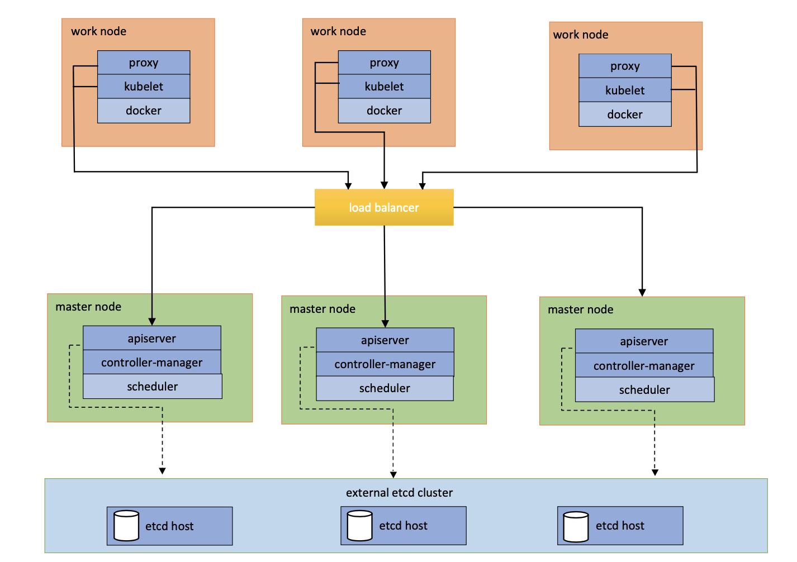
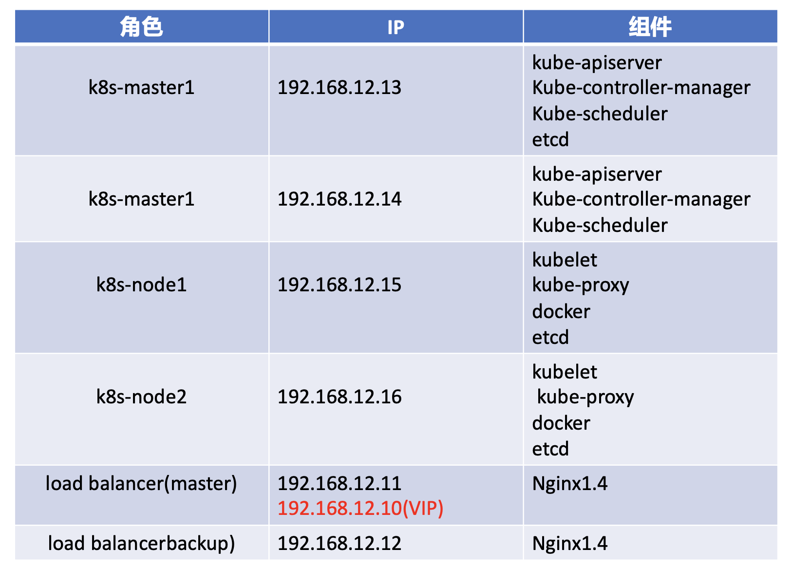
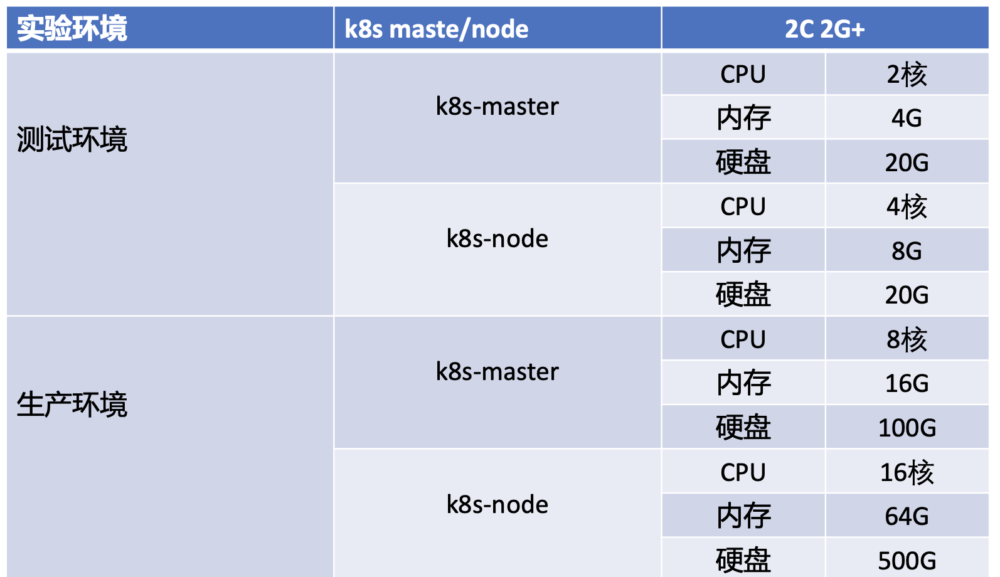

# Kubernets 学习笔记

## 第一节 kuebernets 概述

## 1.1 K8s是什么

- kubernets简称k8s;
- k8s本质上是一组服务器集群，k8s可以在集群的各个节点上运行特定的docker容器；
- K8s用于容器化应用程序部署，扩展和管理；
- k8s是Google在2014年开园的一个容器集群管理系统；
- k8s提供了容器编排，资源调度，弹性伸缩，服务管理。服务发现等一系列功能；
- k8s目标是让部署容器化应用简单高效。

## 1.2 k8s功能

- 自我修复
- 弹性伸缩: 根据服务器的并发情况，并发或者缩减容器数量
- 自动部署和回滚: yaml文件
- 服务发现和负载均衡
- 机密和配置管理

## 1.3 k8s 节点

k8s分为两类结点:

- master node：主结点
- work node：工作结点

### 1.3.1 master 节点的组件(程序)

- Api Server：集群的统一入口，各组件的协调者，以RestFul API提供接口服务，所有对象资源的增删改查和监听等操作都交给API Server处理后再提交给Etcd存储 (接收客户端操作可执行的k8s命令)；
- scheduler：根据调度算法为新创建的Pod选择一个Node节点，可以任意部署，可以部署在同一个节点上，也可以部署在不同节点上（从多个work node节点的组件中选举一个来启动服务)；
- controller manager：处理集群中常规后台任务，一个资源对应一个控制器，而controller manager就是负责管理这些控制器的（向work节点的kubelet发送指令);
- etcd: 分布式键值存储系统，用于保存集群状态数据，比如Pod，Service等对象信息（欢聚话说即 k8s数据库，用来注册节点、服务、记录账号等一系列操作）

### 1.3.2 node 节点的组件(程序)

- kubelet：kubectl是master在node节点上的agent，管理本机运行容器的声明周期，比如创建容器、Pod挂载数据卷、下载secret、获取容器和结点状态等工作，kubelet将每个pod转换成一组容器（向docker发送指令管理docker容器的）；
- kubeproxy：在node节点上实现pod网络代理，维护网络规则和四层负载均衡工作(管理docker容器的网络)；
- docker或rocket：容器引擎，运行容器。

**k8s架构图下**


容器启动的一个过程:

- 客户端向API Server发送请求，即kubectl → API Server
- API Server收到请求后，会向scheduler发送指令，即API Server→scheduler
- scheduler会向后端若干个结点中寻找一个节点（例如节点/node1），即schedule→（寻找node结点）节点/node
- scheduler寻找到节点后，scheduler会将结果返回API Server 即scheduler→API Server
- API Server接收到scheduler返回的寻找的结点后，会传递给controller manager 即API Server → controller manager
- controller manager 会向选定的结点（例如节点/node1）发送指令消息，即controller→kubectl
- kubectl 收到controller传递过来的信息后，会向本地主机docker发送指令,启动一个容器（即pod），即kubectl→（本地）docker

## 1.4 pod 概念(重要)

- 最小部署单元
- 一个pod可以有一个或者多个容器——容器组
- 一组容器的集合
- 一个pod中的容器共享网络命名空间
- pod是短暂的

**注:**

k8是否可以直接启动容器？

答: 不能，因为k8s里面最小的调度单元是pod。

## 1.5 controllers

控制器，控制pod，启动、停止、删除pod

- ReplicaSet：确保预期的pod副本数数量
- Deployment：无状态应用部署
- StatefulSet：有状态应用部署
- DaemonSet：确保所有node运行同一个pod
- Job：一次性任务
- Cronjob：定时任务

## 1.6 Service

将一组pod关联起来，提供一个统一的入口，及时pod地址发生改变，这个统一入口也不会变化，可以保证用户访问不受影响。

- 防止pod失联；
- 定义一组pod的访问策略。

**service 内部流程**



## 1.7 Label

一组pod是一个统一的标签，service是通过标签和一组pod进行关联的。

- 标签，附加到某个资源上，用于关联对象、查询和筛选。

**label图示(Services下面的名字如nginx即为label)**



## 1.8 Namespace

用来隔离pod运行空间(默认情况下，pod是可以互相访问的)；

使用场景：

- 为不同的公司提供隔离的pod运行环境；
- 为开发环境、测试环境、生产环境分别准备不同的命名空间，进行隔离。


# 第二节 搭建一个完成的kubernets集群

## 2.1 安装步骤

1. 生产环境k8s平台规划
2. 服务器硬件配置推荐
3. 官方提供三种部署方式
4. 为Etcd和APIServer自签SSL证书
5. Etcd数据库集群部署
6. 部署Master组件
7. 部署Node组件
8. 部署K8s集群网络
9. 部署Web UI(DashBoard)
10. 部署集群内部DNS解析服(CoreDNS)

## 2.2 生产环境k8s平台规划

架构类别

单master节点和多master节点

**单master节点**

- 略

**多master节点**

- 一般建议用三个master节点(避免单节点故障)，用load balancer做负载均衡
- etcd必须用三台(必须是奇数，避免选举问题)
- work节点越多越好

**多master节点架构图**



**平台规划(两master两node,演示)**



**服务器配置**



## 2.3 k8s安装

基本步骤

- 配置三个节点主机名
- 关闭防火墙
- 关闭selinux
- 关闭swap
- 修改hosts(三个节点可以基于主机名通信)
- 配置时间同步

### 2.3.1 单节点集群

先实现一个master，两个node的集群。

1. 集群规划

   master

   主机名：k8s-maste1

   IP: 192.168.12.13

   worker1

   主机名：k8s-node1

   IP：192.168.12.15

   work2

   主机名：k8s-node2

   IP：192.168.12.16

   k8s版本：1.6

   试验方式：离线、二进制安装

   操作系统版本：centos7.7
   
2. 初始化服务

   2.1 关闭防火墙

   ```bash
   // 所有主机结点都执行
   # systemctl stop firwewalld
   
   # systemctl disable firewalld
   ```

   2.2 关闭SeLinux

   ```bash
   // 临时关闭
   # setenforce 0
   
   // 永久关闭
   # vim /etc/selinuxconfig
   // 将SELINUX=enforcing 改成SELINUX=disabled
   ```

   2.3 配置主机名

   ```bash
   // 所有结点都要执行初始化操作
   # hostnamrctl set-hostname k8s-master1
   ```

   2.4 配置名称解析

   ```bash
   // 所有结点都执行,执行方法一样
   
   // 修改host
   192.168.12.13 k8s-master1
   192.168.12.14 k8s-mster2
   192.168.12.15 k8s-node1
   192.168.12.16 k8s-node2
   ```

   2.5 配置时间同步

   选择一个结点作为服务端，剩下的作为客户端

   master1为时间服务器的服务端，其他的作为时间服务器的客户端

   2.5.1 配置k8s-master1

   ```bash
   # yum install chrony -y
   # vim /etc/chrony.conf
   
   // 不选用上游服务器，选择本机做为服务器
   // 修改三项
   // 1. server 127.127.1.0 iburst
   // 2. allow 192.168.12.0/24
   // 3. local stratum 10
   
   // 启动服务端
   # systemctl start chronyd
   # systemctl enable chronyd
   
   // 检查是否启动
   # ss -un1 | grep 123
   ```

   2.5.2 配置客户端

   ```bash
   # yum install chrony -y
   # vim /etc/chrony.conf
   
   // 修改其中一项
   server 192.168.12.13
   
   // 启动服务端
   # systemctl start chronyd
   # systemctl enable chronyd
   
   // 检查配置
   # chronyc sources
   ```

   2.6 关闭交换分区

   ```bash
   // 先关闭交换分区
   # swapoof -a 
   
   # vim /fstdb
   
   // 将最后一行/dev/mapper/centos.swap swap 删除或者注释
   
   // 查看是否关闭
   # free -mh
   ```

3. k8s安装

   3.1 加密

   3.1.1 对称加密：加密解密用相同的密钥

   3.1.2 非对称加密：用公钥-私钥的密钥对实现加密

   3.1.3 单向加密：只能加密，不能解密（比如md5）

   3.2 SSL 证书和相关概念

   PKI(Public Key Infrasturcture 公钥基础设施)

   一个完整的PKI包括以下几个部分

   1）端实体（申请者）

   2）注册结构（RC）

   3）签证机构（CA）

   4）证书撤销列表（CRL）

   5）证书存取库

   SSL 证书来源：

   网络第三方机构购买，通常这种证书用于让外部用户访问使用

   自己给自己生成证书-自签证书，通常用于内网使用

   自建CA

   openssl

   cfssl(一般用于这个)

   1. k8s安装

      3.1 加密

      3.1.1 对称加密：加密解密用相同的密钥

      3.1.2 非对称加密：用公钥-私钥的密钥对实现加密

      3.1.3 单向加密：只能加密，不能解密（比如md5）

      3.2 SSL 证书和相关概念

      PKI(Public Key Infrasturcture 公钥基础设施)

      一个完整的PKI包括以下几个部分

      1）端实体（申请者）

      2）注册结构（RC）

      3）签证机构（CA）

      4）证书撤销列表（CRL）

      5）证书存取库

      SSL 证书来源：

      网络第三方机构购买，通常这种证书用于让外部用户访问使用

      自己给自己生成证书-自签证书，通常用于内网使用

      自建CA

      openssl

      cfssl(一般用于这个)

      

      **注**: cfssl 下载地址 https://pkg.cfssl.org/

      ​      cfssl 源码地址 [<https://github.com/cloudflare/cfssl>](<https://github.com/cloudflare/cfssl>)

      

      3.3 部署etcd

      二进制包下载地址

      https://github.com/etcd-io/etcd/releases

      etcd需要三台虚拟机

      在master、node1、node2上分别安装一个etcd（仅学习试验用，生产一般将etcd部署到独立服务器）

      3.3.1 给etcd颁发证书（用到的包为TLS.tar.gz）

      操作路径为 /root

      ```bash
      # tar -zxvf TLS.tar.gz
      
      // 生成一个TLS文件
      # ls TLS
      // cfssl cfssl-certinfo  cfssjson cfssl.sh etcd k8s
      // 其中etcd跟k8s问文件夹为etcd为etcd办法证书使用的，k8s为k8s颁发证书使用的
      
      # cd TLS/etcd
      # ./cfssl.sh
      # cd etcd 
      # ls
      // ca-config.json ca-csr.json generate_etcd_cert.sh server-csr.json
      // 修改server-csr.json,里面的hosts，为etcd所在的主机结点
      // 
      ```

      ```bash
      // 在/root/TLS/etcd目录下
      # ./generate_etcd_cert.sh
      // 即可实现ca证书的生成与颁发
      
      # ls *pem
      // ca-key.pem ca.pem server-key.pem server.pem
      // ca 开头的是服务器ca自己的证书，server开头的是etcd的证书
      ```

      过程总结为下面三步

      1）创建证书颁发机构

      2）填写表单-写明etcd所在结点的ip

      3）向证书颁发机构申请证书

      3.3.2 安装etcd

      /root/ectd.tar.gz

      ```bash
      # cd /root
      # tar -zxvf ectd.tar.gz
      // 解压后会生成一个文件和一个目录
      // etcd.service etd(文件夹)
      
      // 移动etcd.service
      # mv etcd.service /usr/lib/systemd/system
      
      // 移动etcd(目录)
      # mv etcd /opt //移动目录根据etcd.service指定的
      // centos7 systemd的服务管理脚本在那个地方？
      // /usr/lib/systemd/system
      
      // centos6 sysv风格服务器管理脚本在哪？
      // /etc/rc.d/rcN.d
      // N 0 1 2 3 4 5 6
      ```

      修改etcd配置文件

      ```bash
      // 目录/opt/etcd/cfg/etcd.conf
      # vim /opt/etcd/cfg/etcd.conf
      // 有Master与Clustering，需配置一个Master
      // # [Master]
      // ETCD_NAME = "etcd-1"
      // ETCD_DATA_DIR = "/var/lib/etcd/default.etcd"
      // ETCD_LISTEN_PEER_URLS = "<https://192.168.12.13:2380>" // 用来接收其他etcd发送过来的数据
      // ETCD_LISTEN_CLIENT_URLS ="<https://192.68.12.13:2379>" // 用来和客户端通信
      
      // 集群部分
      // #[Clustering]
      // ETCD_INITIAL_ADVERTISE_PEER_URLS = "<https://192.168.12.13:2380>"
      // ETCD_ADVERTISE_CLIENT_URLS = "<https://192.168.12.13:2379>"
      // ETCD_INITIAL_CLUSTER = "etcd-1=https://192.168.12.13:2380, etcd-2=https://192.168.12.15:2380, etcd-3=https://192.168.12.16:2380"
      // ETCD_INITIAL_CLUSTER_TOKEN = "etcd-cluster"
      // ETCD_INITIAL_CLUSTER_STATE = "new"
      ```

      拷贝证书

      ```bash
      // 证书在/root/TLS下
      # cp /root/TLS/etcd/{ca,server,server-key}.pem /opt/ectd/ssl
      // 如果文件存在 强行复制
      # \\cp -f /root/TLS/etcd/{ca,server,server-key}.pem /opt/ectd/ssl
      ```

      将etc管理程序和程序目录发送到node1和node2,并做修改

      在三个节点启动etcd

      ```bash
      // 启动etcd服务
      # systemctl start etcd
      // 设置etcd服务开机启动
      # systemctl enable etcd.service
      ```

      3.3.3 查看集群状态

      ```bash
      # /opt/etcd/bin/etcdctl \\
      --ca-file=/opt/etcd/ssl/ca.pem --cert-file=/opt/etcd/ssl/server.pem \\
      --key-file=/opt/etcd/ssl/server-key.pem \\
      --endpoints = "<https://192.168.12.13:2379>,<https://192.168.12.15:2379>,<https://192.168.12.16:2379>" \\
      cluster-health
      ```
   
4. 安装master

   k8s 安装包下载地址 https://github.com/kubernetes/kubernetes/releases

   官方地址: https://pkgs.org/download/kubernetes-master

   需要用到一个安装包 k8s-master.tar.gz

   ```bash
   // 解压k8s-master.tar.gz
   // 会生成三个文件和一个目录
   // kube-apiserver.service kube-controller.manager.service kube-scheduler.service kubernets(文件夹)
   
   # mv kube-apiserver.service kube-controller-manager.service kube-scheduler.service /usr/lib/systemd/system/
   # mv kubernets /opt/
   # cp /root/TLS/k8s/{ca*pem,server.pem,server-key.pem} /opt/kubernets/ssl -rvf
   
   //修改apiserver配置文件
   # vim /opt/kubernets/cfg/kube-apiserver.conf
   // 内容如下
   // KUBE_APISERVER_OPTS="--logtostderr-false \\
   --v=2 \\
   --log-dir=/opt/kubernets/logs \\
   --etcd-server=https://192.168.12.13:2379,<https://192.168.12.15:2379>,<https://192.168.12.16:2379> \\ 
   --bind-address=192.168.12.13 \\
   --secure-port=6443 \\
   --advertise-address=192.168.12.13 \\
   --allow-priviledged=true \\
   ~~-~~-service-cluster-ip-range=10.0.0.0/24 \\
   --enable=admission-plugins=NamespaceLifecycle,LimitRanger,ServiceAccount,ResourceQutia,NodeRestriction \\
   --authorization-mode=RABC,Node \\
   --enable-bootstrap-token-auth=true \\
   --token-auth-file=/opt/kubernets/cfg/token.csv \\
   --service-node-port=range=30000-32767 \\
   --kubelet-client-certificate=/opt/kubernets/ssl/server.pem \\
   --kubelet-client-key=/opt/kubernets/ssl/server-key.pem \\
   --tls-cert-file=/opt/kubernets/ssl/server.pem \\
   --tls-private-key-file=/opt/kubernets/ssl/server.pem \\
   --client-ca-file=/opt/kubernets/ssl/ca.pem \\
   --service-account-key-file=/opt/kubernets/ss/ca-key.pem \\
   --etcd-cafile=/opt/etcd/ssl/ca.pem \\
   --etcd-certfile=/opt/etcd/ssl/server.pem \\
   --etcd-keyfile=/opt/etcd/ss/server-key.pem \\
   --audit-log-maxage=30 \\
   --audit-log=maxbackup=3 \\
   --audit-log-maxsize=100 \\
   --audit-log-path=/opt/kubernets/logs/k8s-audit.log"
   
   // 修改kube-controller-manager配置文件
   # vim /opt/kubernets/cfg/kube-controller-manager.conf
   // 内容如下
   // KUBE_CONTROLLER_MANAGER_OPTS="--logtostderr=false \\
   --v=2 \\
   --log-dir=/opt/kubernets/logs \\
   --leader-elect=true \\
   --master=127.0.0.1:8080 \\
   --address=127.0.0.1 \\
   --allocate-node-cidrs=true \\
   --cluster=cidr=10.244.0.0.0/16 \\
   --service-cluster-ip-range=10.0.0.0/24 \\
   --cluster=signing-cert-file=/opt/kubernets/ssl/ca.pem\\
   --cluster=signing-key-file=/opt/kubernets/ssl/ca-key.pem \\
   --root-ca-file=/opt/kubernets/ssl/ca.pem \\
   --service-account-private-key-file=/opt/kuberntes/ssl/ca-key.pem \\
   --exprimental-cluster-signing-duration=87600h0m0s"
   
   // 修改kube-scheduler配置文件
   # vim /opt/kubernets/cfg/kube-scheduler.conf
   // 内容如下
   // KUBE_SCHEDULER_OPTS="--logtostderr=false \\
   --v=2 \\
   --log-dit=/opt/kubernets/logs \\
   --leader-elect \\
   --master=127.0.0.1:8080 \\
   --address=127.0.0.1"
   
   // 启动服务
   # systemctl start kube-apiserver
   # ssytemctl start kube-schedule
   # systemctl start kube-controller-manager
   
   // 设置开机启动
   # systemctl enable kube-apiserver
   # systemctl enable kune-schedule
   # systemctl enable kube-controller-manager
   
   // 验证服务
   # ps aux | grep kube
   
   // 查看日志
   # tail =f /opt/kubernets/logs/kube-apiserver.INFO
   
   // kubectl命令
   # cp /opt/kubernets/bin/kubectl /bin
   
   // 配置tls基于bootstrap自动颁发证书
   // kube-apiserver配置文件里面的内容
   // --enable-bootstrap-token-auth=true \\
   // --token-auth-file=/opt/kubernets/cfg/token.csv
   # cat /opt/kubernets/cfg/token.csv
   // c47ffb939f5ca36231d9e3121a252940,kubelet-bootstrap,1001,"system:node-bootstrapper"
   
   // 启用TSL授权
   # kubectl create clusterrolebinding kubelet-bootstrap \\
   --clusterrole=system:node-bootstrapper \\
   --user=kubectl-bootstrap
   // 这里里面的内容跟上面csv里面的用户保持对应
   
   // 检查是否启动成功
   # kubectl get cs
   ```

5. 部署work-node组件

   node 组件对应的有

   5.1 work-node组件介绍

   docker：用来启动容器

   kubelet：用来接收api的指令，然后控制docker容器

   kube-proxy：为work上的容器配置网络工作

   5.2 安装部署

   5.2.1 docker 安装

   文件 k8s-node.tar.gz

   ```bash
   // 解压
   # tar -zxvf k8s-node.tar.gz
   // docker-18.09.6.tgz docker.server daemon.json
   # mv docker.service /usr/lib/systemd/system
   # mkdir /etc/docker
   # mv daemon.json /etc/docker
   # tar xf docker-18.09.6.tgz
   // 生成docker文件
   # ls docker
   // containerd containerd-shim ctr docker dockerd docker-init docker-proxy runc
   # mc docker/* /bin
   
   // 启动docker
   # systemctl start docker 
   
   // 开机启动
   # systemctl enable docker 
   ```

   用来接收api的指令，然后控制docker容器

   5.2.2 kubelet 安装

   解压 k8s-node.tar.gz 会生成一个目录kubernets, 两个脚本kubelet.service, kub-proxy.service

   ```bash
   # ls kubernets/
   // bin cfg logs ssl
   
   # mv kubelet.service kube-proxy.service /usr/lib/systemd/system
   # mv kubernets /opt 
   // 移动位置是由上面两个service文件决定的
   
   // 1. 修改配置文件kube-proxy.kubeconfig 文件
   # vim /opt/kubernets/cfg/kube-proxy.kubeconfig
   // 内容如下
   //  ApiVersion: v1
   //  clusters:
   //  - cluster:
   //      certificate-authority: /opt/kubernets/ssl/ca.pem
   //      server: <https://192.168.12.13:6443> // master ip地址
   //    name: kubernets
   //  contexts:
   //  - context:
   //      cluster: kubernets
   //      user: kube-proxy
   //    name: default
   //  current-context: default
   //  kind: Config
   //  preferences: {}
   //  users: 
   //  - name: kube-proxy
   //  user:
   //    client-certificate: /opt/kubernets/ssl/kube-proxy.pem
   //    client-key: /opt/kubernets/ssl/kube-proxy.pem
   
   // 修改server: <https://192.168.12.13:6443> 改为master ip
   
   // 2. 修改kube-config.yml
   # vim /opt/kubernets/cfg/kube-proxykube-config.yml
   // 内容如下
   //  kind: kubeProxyConfiguration
   //  apiVersion: kubeproxy.config.k8s.io/vlalphal
   //  address: 0.0.0.0
   //  metricsBindAddess: 0.0.0.0:10249
   //  clientConnection:
   //    kubeconfig: /opt/kubernets/cfg/kube-proxy.kuberconofig
   //  hostnameOverride: k8s-node1
   //  mode: ipvs
   //  ipvs:
   //    scheduler: "rr"
   //  iptables:
   //    masqueradAll: true
   
   // 确定hostnameOverride为当前服务器主机名
   
   // 3. 修改kube-proxy.conf 文件
   # vim /opt/kubernets/cfg/kube-proxy.conf
   // 内容如下
   //  KUBE_PROXY_OPTS="--logtostderr=false \\
   --v=2\\
   --log-dir=/opt/kubernets/logs \\
   --config=/opt/kubernets/cfg.kube-proxy-config.yml"
   
   // kubectl-config.yml 不需要修改
   
   // 4. 修改kubeclt.conf
   # vim /opt/kubernets/cfg/kubelet.conf
   // 内容如下
   // KUBELET_OPTS="--logtostderr=false \\
   --v=2 \\
   --log-dir=/opt/kubernets/logs \\
   --hostname-override=k8s-node1 \\
   --network-plugins=cni \\ // 支持cni插件
   --kubeconfig=/opt/kubernets/cfg/kubelet.kubeconfig \\
   --bootstrap-kubeconfig=/opt/kubernets/cfg/kubelet-config.yml \\
   --config=/opt/kubernets/cfg/kubelet-config.yml \\
   --cert-dir=/opt/kubernets/ssl \\
   --pof-infra-container-image=lizhenliang/pause-amd64:3.0"
   
   // 5. 修改bootstrap.kubeconfig
   
   // 只需要修改server内容
   // server: <http://192.168.12.13:6443>
   ```

   5.2.3  从master节点复制证书到node节点

   ```bash
   // 需要复制的内容有 
   // master 节点(192.168.12.13) /root/TLS/k8s下面
   // ca.pem ,kube-proxy.pem, kube-proxy-key.pem
   // 将上述三个文件复制到k8s-node1节点 /opt/kubernets/ssl/ 目录下```
   ```

   5.2.4 启动服务

   ```bash
   # systemctl start kube-proxy
   # system start kubelet
   
   # systemctl enable kube-proxy
   # systemctl enable kubelet
   ```

   5.2.5 在master节点为work-node颁发证书

   ```bash
   // 在master节点执行 
   # kubelet get csr
   // NAME                                                  AGE           REQUESTOR           CONNECTION
   // node-csr-Uv61q1janAJ0ApprHc9RcSPV0qSsD-Z4qDdapAvsWo   6m6s          kubelet-bootstrap   pending 
   
   // 颁发证书
   # kubectl certificate approve  node-csr-Uv61q1janAJ0ApprHc9RcSPV0qSsD-Z4qDdapAvsWo 
   // 执行后即可颁发证书
   
   # kubelet get csr
   // NAME                                                  AGE           REQUESTOR           CONNECTION
   // node-csr-Uv61q1janAJ0ApprHc9RcSPV0qSsD-Z4qDdapAvsWo   6m6s          kubelet-bootstrap   Approved,Issued
   ```

   5.2.6  给work节点颁发证书后，就可以看到节点了

   ```bash
   # kubeclt get nodes
   ```

6. 安装插件

   6.1 确认启动cni插件

   在work节点查看

   ```bash
   # vim /opt/kubernets/cfg/kubelet.conf
   // --network-plugins=cni
   ```

   6.2  安装插件

   1） 创建目录

   ```bash
   # mkdir -pv /opt/cni/bin /etc/cin/net.d
   ```

   用到的文件cni-plugins-linux-amd64

   1. 安装CNI

   ```bash
   # tar xf cni-pkugins-linux-amd64-v.0.02.tgz -C /opt/cni/bin
   ```

   3）在master上执行yaml脚本，实现在work节点安装启动网络插件功能

   ```bash
   // 在master节点上执行
   # kubelet apply -f kube-flannel.yaml
   
   // 删除用以下命令
   # kubelet delete -f kube-flannel.yaml
   ```

   1. 授权apiserver可以访问kubelet

   ```bash
   # kubctl apply -f apiserver-to-kubelet-rbac.yaml
   ```

7. 部署nginx 示例,在master上操作的

   ```bash
   // 创建deployment,通过deployment来创建和管理nginx容器
   # kubectl create deployment myweb --image=nginx:1.8
   
   // 查看deployment状态
   # kubectl get deployment
   
   // 查看pods状态
   # kubectl get pods 
   
   // 将端口暴露出来
   # kubectl expose deployment myweb --port=80 --type=NodePort
   
   // 查看服务
   // 查看将80端口映射到那个端口
   # kubectl get service (简称svc)
   // NAME    TYPE      CLUSTER-IP    EXTERNAL-IP    PORT(S)     AGE
   // myweb   NodePort  10.0.0.18     <None>         80:30828    28s
   
   // 访问集群任意结点的30828来访问nginx
   ```